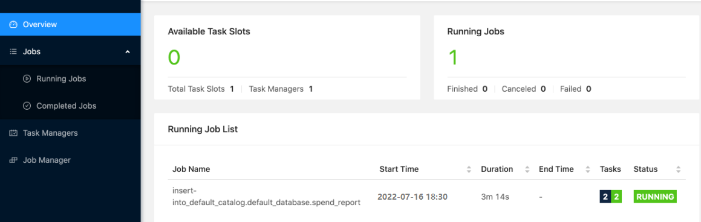
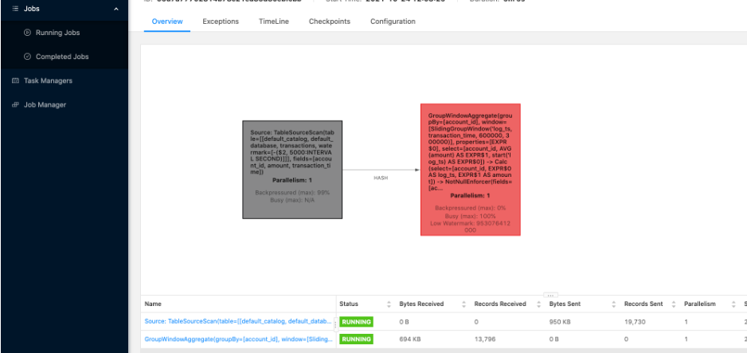
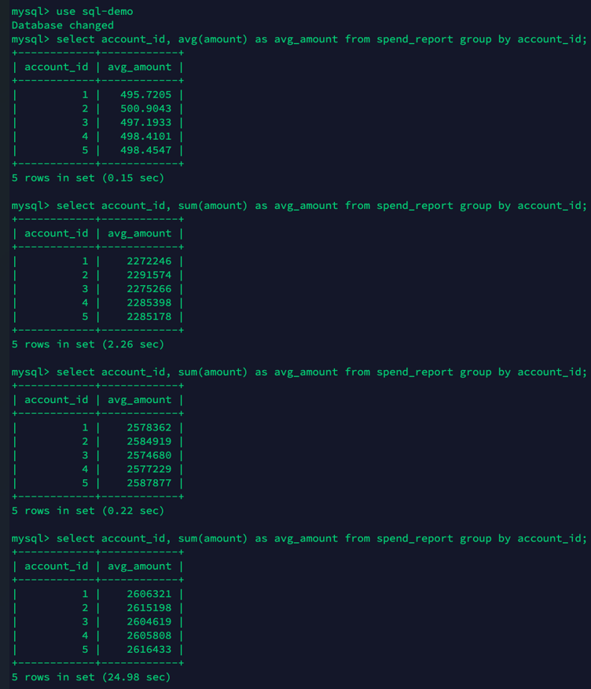
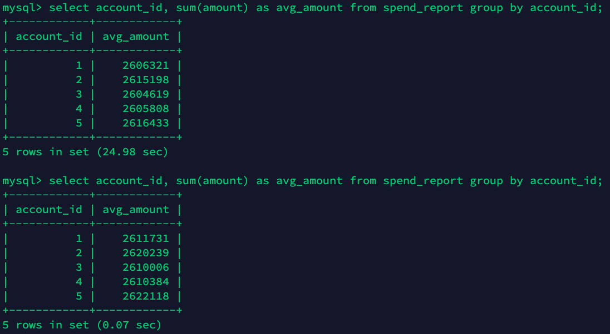
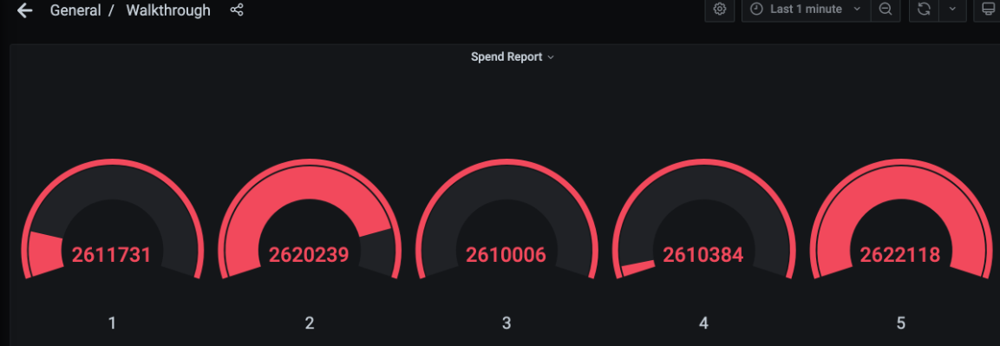

### 题目

report(transactions).executeInsert("spend_report");
将transactions表经过report函数处理后写入到spend_report表。

每分钟（小时）计算在五分钟（小时）内每个账号的平均交易金额（滑动窗口）？

注：使用分钟还是小时作为单位均可


### 代码

```java
/*
 * Licensed to the Apache Software Foundation (ASF) under one
 * or more contributor license agreements.  See the NOTICE file
 * distributed with this work for additional information
 * regarding copyright ownership.  The ASF licenses this file
 * to you under the Apache License, Version 2.0 (the
 * "License"); you may not use this file except in compliance
 * with the License.  You may obtain a copy of the License at
 *
 *     http://www.apache.org/licenses/LICENSE-2.0
 *
 * Unless required by applicable law or agreed to in writing, software
 * distributed under the License is distributed on an "AS IS" BASIS,
 * WITHOUT WARRANTIES OR CONDITIONS OF ANY KIND, either express or implied.
 * See the License for the specific language governing permissions and
 * limitations under the License.
 */

package org.apache.flink.playgrounds.spendreport;

import org.apache.flink.table.api.*;
//import org.apache.flink.table.expressions.TimeIntervalUnit;

import static org.apache.flink.table.api.Expressions.*;

public class SpendReport {

    public static Table report(Table transactions) {
        return transactions
                .window(Slide.over(lit(5).hours()).every(lit(1).hours())
                        .on($("transaction_time"))
                        .as("hourly_window"))
                .groupBy($("account_id"),$("hourly_window"))
                .select(
                        $("account_id"),
                        $("hourly_window").start().as("log_ts"),
                        $("amount").avg().as("amount"));
//        throw new UnimplementedException();
    }

    public static void main(String[] args) throws Exception {
        EnvironmentSettings settings = EnvironmentSettings.newInstance().build();
        TableEnvironment tEnv = TableEnvironment.create(settings);

        tEnv.executeSql("CREATE TABLE transactions (\n" +
                "    account_id  BIGINT,\n" +
                "    amount      BIGINT,\n" +
                "    transaction_time TIMESTAMP(3),\n" +
                "    WATERMARK FOR transaction_time AS transaction_time - INTERVAL '5' SECOND\n" +
                ") WITH (\n" +
                "    'connector' = 'kafka',\n" +
                "    'topic'     = 'transactions',\n" +
                "    'properties.bootstrap.servers' = 'kafka:9092',\n" +
                "    'format'    = 'csv'\n" +
                ")");

        tEnv.executeSql("CREATE TABLE spend_report (\n" +
                "    account_id BIGINT,\n" +
                "    log_ts     TIMESTAMP(3),\n" +
                "    amount     BIGINT\n," +
                "    PRIMARY KEY (account_id, log_ts) NOT ENFORCED" +
                ") WITH (\n" +
                "  'connector'  = 'jdbc',\n" +
                "  'url'        = 'jdbc:mysql://mysql:3306/sql-demo',\n" +
                "  'table-name' = 'spend_report',\n" +
                "  'driver'     = 'com.mysql.jdbc.Driver',\n" +
                "  'username'   = 'sql-demo',\n" +
                "  'password'   = 'demo-sql'\n" +
                ")");

        Table transactions = tEnv.from("transactions");
        report(transactions).executeInsert("spend_report");
    }
}
```

### 执行结果和监控Dashboard

#### **Flink Dashboard**







#### **MySQL执行结果如下**






#### Grafana查看结果如下

