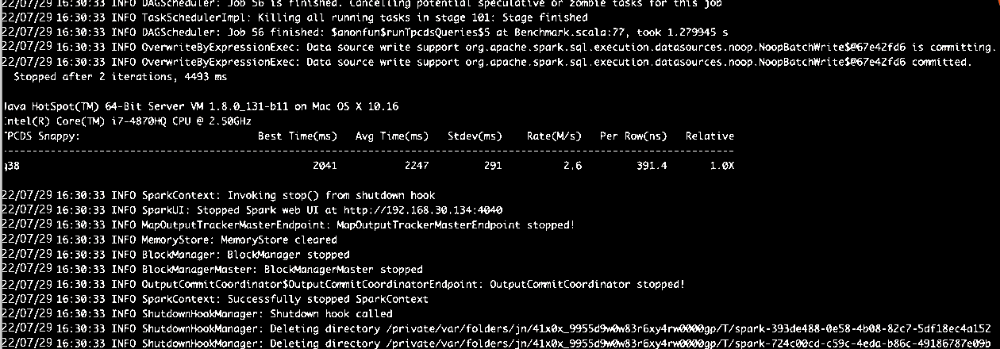
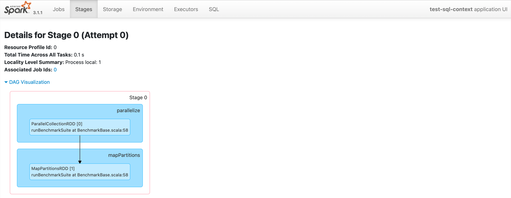
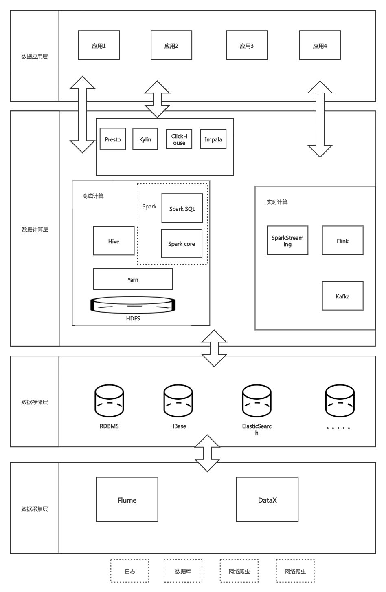
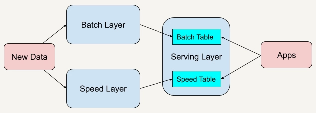
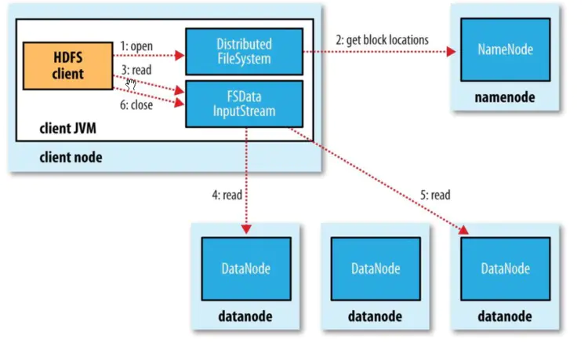
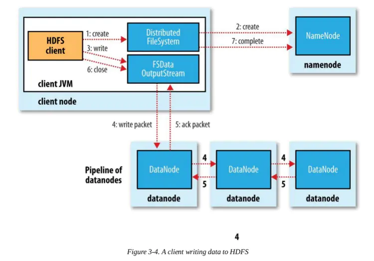

# 毕业项目

## 题目一: 分析一条 TPCDS SQL(请基于 Spark 3.1.1 版本解答)

SQL 从中任意选择一条: https://github.com/apache/spark/tree/master/sql/core/src/test/resources/tpcds  

(1)运行该 SQL，如 q38，并截图该 SQL 的 SQL 执行图
(2)该 SQL 用到了哪些优化规则(optimizer rules)
(3)请各用不少于 200 字描述其中的两条优化规则


1. 从 github 下载 TPCDS 数据生成器

    ```shell
    >git clone https://github.com/maropu/spark-tpcds-datagen.git
    >cd spark-tpcds-datagen
    ```

2. 下载 Spark3.1.1 到 spark-tpcds-datagen 目录并解压

    ```shell
    >wget https://archive.apache.org/dist/spark/spark-3.1.1/spark-3.1.1-bin-hadoop2.7.tgz
    >tar -zxvf spark-3.1.1-bin-hadoop2.7.tgz
    ```

3. 生成数据

    ```shell
    >mkdir -p tpcds-data-1g
    >export SPARK_HOME=./spark-3.1.1-bin-hadoop2.7
    >./bin/dsdgen --output-location tpcds-data-1g
    ```

4. 下载三个 test jar 并放到当前目录

    ```shell
    >wget https://repo1.maven.org/maven2/org/apache/spark/spark-catalyst_2.12/3.1.1/spark-catalyst_2.1 2-3.1.1-tests.jar
    >wget https://repo1.maven.org/maven2/org/apache/spark/spark-core_2.12/3.1.1/spark-core_2.12-3.1.1-tests.jar
    >wget https://repo1.maven.org/maven2/org/apache/spark/spark-sql_2.12/3.1.1/spark-sql_2.12-3.1.1-te sts.jar
    ```

5. 执行 SQL

    ```shell
    >./spark-3.1.1-bin-hadoop2.7/bin/spark-submit --class org.apache.spark.sql.execution.benchmark.TPCDSQueryBenchmark  --jars spark-core_2.12-3.1.1-tests.jar,spark-catalyst_2.12-3.1.1-tests.jar spark-sql_2.12-3.1.1-tests.jar --data-location tpcds-data-1g --query-filter "q73"
    ```

### 题目一解答

添加查看执行计划配置，并执行SQL

```shell
>./spark-3.1.1-bin-hadoop2.7/bin/spark-submit --class org.apache.spark.sql.execution.benchmark.TPCDSQueryBenchmark --conf spark.sql.planChangeLog.level=WARN  --jars spark-core_2.12-3.1.1-tests.jar,spark-catalyst_2.12-3.1.1-tests.jar spark-sql_2.12-3.1.1-tests.jar --data-location tpcds-data-1g --query-filter "q38" > log.txt 2>&1
```

执行截图 :  

Spark UI 截图：  

详细日志文件内容[这里](Graduation1/log.txt)

其中涉及到的优化规则有：  

1. `=== Applying Rule org.apache.spark.sql.catalyst.optimizer.ReplaceIntersectWithSemiJoin ===`
2. `=== Applying Rule org.apache.spark.sql.catalyst.optimizer.ReplaceDistinctWithAggregate ===`  
3. `=== Applying Rule org.apache.spark.sql.catalyst.optimizer.ReorderJoin ===`
4. `=== Applying Rule org.apache.spark.sql.catalyst.optimizer.PushDownLeftSemiAntiJoin ===`
5. `=== Applying Rule org.apache.spark.sql.catalyst.optimizer.ColumnPruning ===`  
6. `=== Applying Rule org.apache.spark.sql.catalyst.optimizer.CollapseProject ===`
7. `=== Applying Rule org.apache.spark.sql.catalyst.optimizer.EliminateLimits ===`  
    消除查询中的Limit，在源码的注释下描述了这样两种场景：  
    第一个，子查询中最大返回行数小于limit数
    第二个，合并两个相邻查询的limit为一个
    以下是源码的优化规则注释：  

    ```scala
    /**
    * This rule optimizes Limit operators by:
    * 1. Eliminate [[Limit]] operators if it's child max row <= limit.
    * 2. Combines two adjacent [[Limit]] operators into one, merging the
    *    expressions into one single expression.
    */
    object EliminateLimits extends Rule[LogicalPlan] {}
    ```

8. `=== Applying Rule org.apache.spark.sql.catalyst.optimizer.ConstantFolding ===`
   常量合并，就是将查询计划中涉及到的可以进行常量计算的部分提前计算好，并将常量表达式替换为计算好的常量。  

9. `=== Applying Rule org.apache.spark.sql.catalyst.optimizer.RemoveNoopOperators ===`
10. `=== Applying Rule org.apache.spark.sql.catalyst.optimizer.InferFiltersFromConstraints ===`
11. `=== Applying Rule org.apache.spark.sql.catalyst.optimizer.PushDownPredicates ===`
12. `=== Applying Rule org.apache.spark.sql.catalyst.optimizer.PushDownLeftSemiAntiJoin ===`
13. `=== Applying Rule org.apache.spark.sql.catalyst.optimizer.RewritePredicateSubquery ===`

优化规则的详细说明和实现参照 [SparkSQL catalyst 优化器中的 Optimizer 源码](https://github.com/apache/spark/blob/v3.1.1/sql/catalyst/src/main/scala/org/apache/spark/sql/catalyst/optimizer/Optimizer.scala)

## 题目二:架构设计题

你是某互联网公司的大数据平台架构师，请设计一套基于 Lambda 架构的数据平台架构，要求尽可能多的把课程中涉及的组件添加到该架构图中。  

并描述 Lambda 架构的优缺点，要求 不少于 300 字。

#### 架构图



#### Lambda 架构优劣

Lambda 架构（Lambda Architecture）是由 Twitter 工程师南森·马茨（Nathan Marz）提出的大数据处理架构。


Lambda 架构总共由三层系统组成：批处理层（Batch Layer），速度处理层（Speed Layer），以及用于响应查询的服务层（Serving Layer）.

批处理层存储管理主数据集（不可变的数据集）和预先批处理计算好的视图。  
速度处理层会实时处理新来的数据。  
服务层通过返回预先计算的数据视图或从速度层处理构建好数据视图来响应查询。

##### 优点

* 系统健壮性、容错能力好，Lambda架构的重要原则中包括了重新计算，这有助于纠正错误，而不会有太大的额外开销。随着越来越多的数据进入数据湖，数据丢失和损坏的代价难以承受。因为可以重新计算，所以可以在任何时候重算、回滚或刷新数据来纠正这些错误；
* 可扩展性好，系统可以进行水平扩展；
* Lambda架构将不同的职能划分为定义明确、边界清晰的功能模块/层。这样各层就可以使用不同的技术，并且可以采用不同的方法来优化这些功能，同时对其他层没有任何影响。
* Lambda架构是一个可插拔的架构。当需要添加一个新的源数据类型或者已经接入已有类型源系统时，该架构可以接入这些源系统而无须做太多改变。

##### 缺点

* 相同的工作要实现两次（在批处理层和快速处理层），这也是Lambda架构模式一直被诟病的一点。

## 题目三:简答题(三选一)

A:简述 HDFS 的读写流程，要求不少于 300 字
B:简述 Spark Shuffle 的工作原理，要求不少于 300 字  
C:简述 Flink SQL 的工作原理，要求不少于 300 字

### 

#### A - 简述 HDFS 的读写流程

##### 读流程



1. 打开分布式文件：调用分布式文件 DistributedFileSystem.open( ) 方法； 
2. 寻址请求：从 NameNode 处得到 DataNode 的地址，DistributedFileSystem使用 RPC 方式调用了NameNode，NameNode 返回存有该副本的DataNode 地址，DistributedFileSystem 返回了一个输入流对象（FSDataInputStream），该对象封装了输入流 DFSInputStream；  
3. 连接到DataNode：调用输入流 FSDataInputStream.read( ) 方法从而让DFSInputStream 连接到 DataNodes；
4. 从 DataNode 中获取数据：通过循环调用 read( ) 方法，从而将数据从 DataNode 传输到客户端；  
5. 读取另外的 DataNode 直到完成：到达块的末端时候，输入流 DFSInputStream 关闭与 DataNode 连接， 寻找下一个 DataNode；
6. 完成读取，关闭连接：即调用输入流 FSDataInputStream.close( )；

##### 写流程



1. 客户端调用 DistributedFileSystem 的 create() 方法，开始创建新文件：DistributedFileSystem 创建 DFSOutputStream，产生一个 RPC 调用，让 NameNode 在文件系统的命名空间中创建这一新文件；  
2. NameNode 接收到用户的写文件的 RPC 请求后，先要执行各种检查，如客户是否有相关的创建权限和该文件是否已存在等，检查都通过后才会创建一个新文件，并将操作记录到编辑日志，然后 DistributedFileSystem会将 DFSOutputStream 对象包装在 FSDataOutStream 实例中，返回客户端；否则文件创建失败并且给客户端抛 IOException。  
3. 客户端开始写文件：DFSOutputStream 会将文件分割成 packets 数据包（一般为 64K），然后将这些 packets 写到其内部的一个叫做 data queue（数据队列）。data queue 会向 NameNode 节点请求适合存储数据副本的 DataNode 节点的列表，然后这些 DataNode 之前生成一个 Pipeline 数据流管道，我们假设副本集参数被设置为 3，那么这个数据流管道中就有 3 个 DataNode 节点。  
4. 首先 DFSOutputStream 会将 packets 向 Pipeline 数据流管道中的第一个 DataNode 节点写数据，第一个DataNode 接收 packets 然后把 packets 写向 Pipeline 中的第二个节点，同理，第二个节点保存接收到的数据然后将数据写向 Pipeline 中的第三个 DataNode 节点。  
5. DFSOutputStream 内部同样维护另外一个内部的写数据确认队列—— ack queue 。当 Pipeline 中的第三个 DataNode 节点将 packets 成功保存后，该节点回向第二个 DataNode 返回一个确认数据写成功的信息，第二个 DataNode 接收到该确认信息后在当前节点数据写成功后也会向 Pipeline 中第一个 DataNode 节点发送一个确认数据写成功的信息，然后第一个节点在收到该信息后如果该节点的数据也写成功后，会将 packets 从 ack queue 中将数据删除。  
6. 完成写操作后，客户端调用 close() 关闭写操作，刷新数据；  
7. 在数据刷新完后 NameNode 后关闭写操作流。到此，整个写操作完成。
